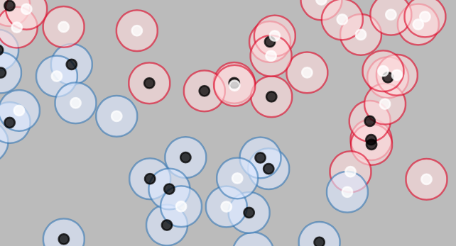

This repository contains an implementation of a simple **Gaussian mixture model** (GMM) fitted with Expectation-Maximization in [pytorch](http://www.pytorch.org). The interface closely follows that of [sklearn](http://scikit-learn.org).

---

A new model is instantiated by calling `gmm.GaussianMixture(..)` and providing as arguments the number of components, as well as the tensor dimension. Note that once instantiated, the model expects tensors in a flattened shape `(n, d)`.

The first step would usually be to fit the model via `model.fit(data)`, then predict with `model.predict(data)`. To reproduce the above figure, just run the provided `example.py`.

Some sanity checks can be executed by calling `python test.py`. To fit data on GPUs, ensure that you first call `model.cuda()`.
